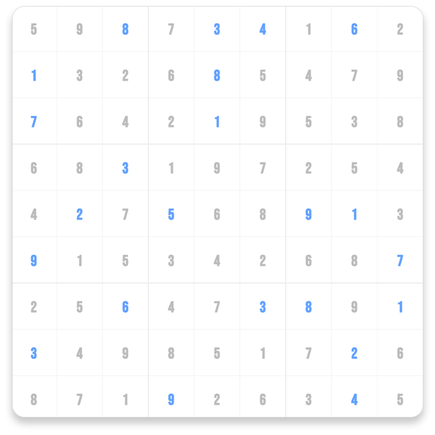

# Sudoku Solver

Simple greedy algorithm to solve Sudoku puzzles.

    

        
        
    

    <small>
        Boredom at it's finest.
    </small>

[Live demo](https://leandrosq.github.io/js-sudoku-solver/)

---

## How to use it

On the folder [src/data](src/data) you can find a file with the Sudoku to solve.

The format on it will be:

    
    2 X 9 X X X 6 X X
    X 4 X 8 7 X X 1 2
    8 X X X 1 9 X 4 X
    X 3 X 7 X X 8 X 1
    X 6 5 X X 8 X 3 X
    1 X X X 3 X X X 7
    X X X 6 5 X 7 X 9
    6 X 4 X X X X 2 X
    X 8 X 3 X 1 4 5 X

    <i>Where 'X' is an empty cell.</i>

To start the solver, just click on the board.
Tha algorithm is animated, so you can see the steps.

## How it works

A simple view on the algorithm used would be:

1. Find the first empty cell
2. Find all possible values for the cell
3. For each possible value
    - Set the value
    - Solve the grid
    - If the grid is solved, return
    - If the grid is not solved, reset the value and go to step 1
4. If no value can be set, return false

This uses recursion and backtracking to achieve the solution.

## Project

Made with:

- [GitHub Pages](https://pages.github.com/)
- [JavaScript](https://developer.mozilla.org/en-US/docs/Web/JavaScript)
- [HTML5 Canvas API](https://developer.mozilla.org/en-US/docs/Web/API/Canvas_API)
- [CSS3](https://developer.mozilla.org/en-US/docs/Web/CSS)
- [HTML5](https://developer.mozilla.org/en-US/docs/Web/HTML)
